Predicting 311 Service Calls in San Francisco
========================================================
author: Max O'Krepki
date: March 1st, 2021
autosize: true

Presentation Outline
========================================================

* Data set overview
* Exploratory analysis
* Existing solutions and next steps

San Francisco 311 Data Set
========================================================

* 311 Calls to the city.
* Date range: July 1st, 2008 - present; continuously updated. 
* ~4,680,000 observations.
* 100 different categories of service calls; top 20 ~95% of calls. 

Calls to the city
========================================================
* Treemap of all 311 calls to the city.

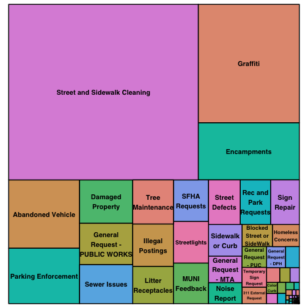

Calls to the city
========================================================
* Treemap of top 10 categories of 311 calls.

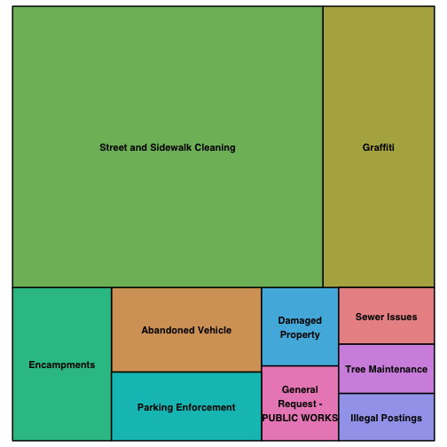

Top 4 Categories
========================================================

|Category                     | Number of Calls| Percent of Total| Cumulative Percent|
|:----------------------------|---------------:|----------------:|------------------:|
|Street and Sidewalk Cleaning |       1,636,815|               38|                 38|
|Graffiti                     |         588,222|               14|                 52|
|Encampments                  |         284,176|                7|                 59|
|Abandoned Vehicle            |         238,242|                6|                 64|

Street and Sidewalk Cleaning
========================================================

Street and Sidewalk Cleaning
========================================================

Street and Sidewalk Cleaning
========================================================

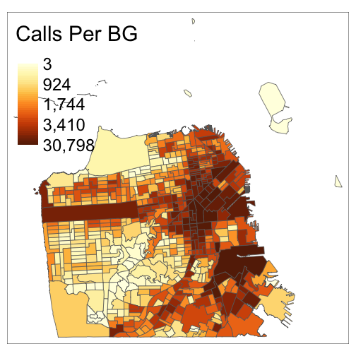

Graffiti
========================================================

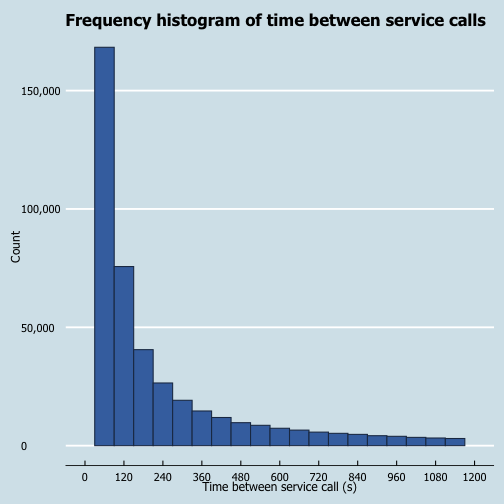

Graffiti
========================================================

Graffiti
========================================================

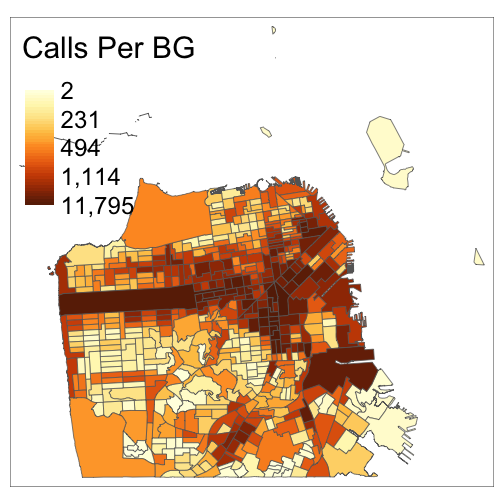

Encampments
========================================================

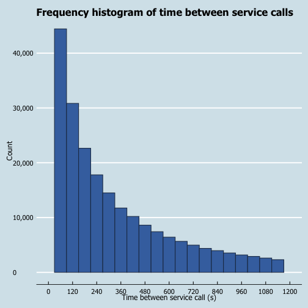

Encampments
========================================================

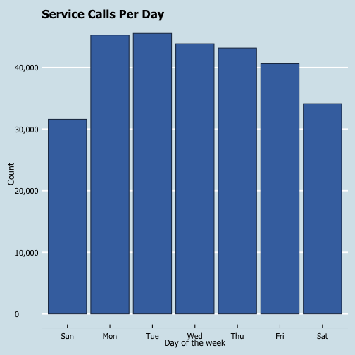

Encampments
========================================================

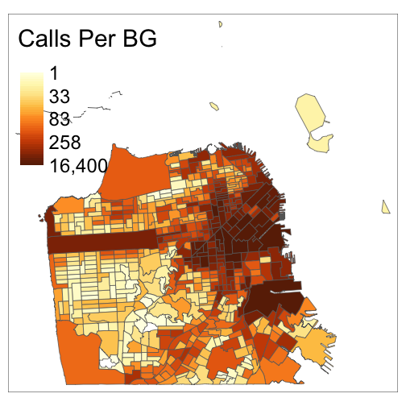

Abandoned Vehicles
========================================================

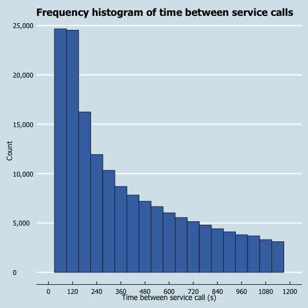

Abandoned Vehicles
========================================================

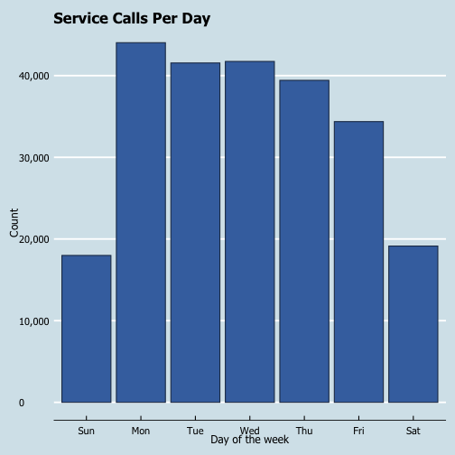

Abandoned Vehicles
========================================================

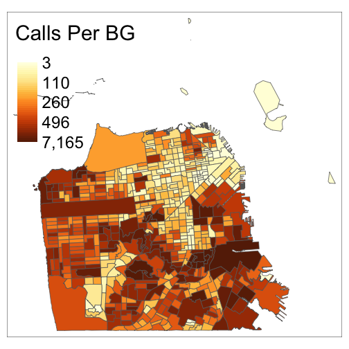

Existing Solutions and Next Steps
========================================================

* Existing solutions
  + Generally context specific
  + Blog post

* Next steps
  + Random forest, k-nearest neighbors
  + Regression based approach
